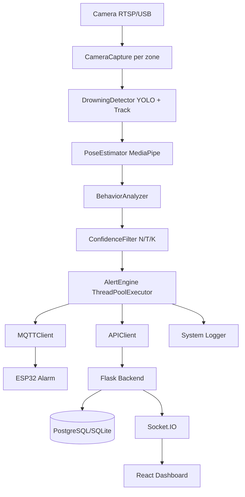

# AquaGuard Architecture Reference

Related artifacts:

- See [ARCHITECTURE_DIAGRAMS.md](ARCHITECTURE_DIAGRAMS.md) for additional visual diagrams.
- See [THREAT_MODEL.md](THREAT_MODEL.md) for security-oriented architecture risks and mitigations.

## 1. System Overview Diagram

AquaGuard is a layered edge-AI + IoT system. Video is processed locally on the detection server, then distributed to physical and dashboard alert channels.

```text
Camera (RTSP/USB)
      |
      v
CameraCapture (threaded, per zone)
      |
      v
DrowningDetector (YOLOv11s, CUDA, ByteTrack)
      | detections: track_id, class, confidence, bbox
      v
PoseEstimator (MediaPipe Pose, ROI crop)
      | 33 normalized landmarks
      v
BehaviorAnalyzer (5-indicator weighted score)
      | score in [0.0, 1.0]
      v
ConfidenceFilter (deque N=15, T=0.75, K=10)
      | alert_triggered: bool
      v
AlertEngine (bounded worker pool)
   +-- MQTTClient --> ESP32 GPIO alarm
   +-- APIClient  --> Flask POST /events --> DB + SocketIO --> React dashboard
   +-- Logger     --> system logs
```



## 2. Component Descriptions

### CameraCapture and CameraRegistry

- Opens RTSP or webcam streams per zone.
- Runs each camera in its own thread.
- Handles reconnect with exponential backoff.
- Publishes frame + metadata to main loop.

### DrowningDetector (YOLOv11s)

- Loads `aquaguard_yolov11s.pt` and performs detection/tracking.
- Uses ByteTrack persistence per detector instance.
- Critical design rule: one detector instance per camera zone, never shared.

### PoseEstimator (MediaPipe Pose)

- Crops per-person ROI from YOLO bbox.
- Produces 33 landmarks (`x`, `y`, `z`, `visibility`) in normalized coordinates.
- Returns `None` when pose cannot be extracted.

### BehaviorAnalyzer

- Computes drowning score from five weighted indicators.
- Maintains per-track motion history and short score history.
- Uses normalized coordinate thresholds (not pixel thresholds).

### ConfidenceFilter

- Maintains per-track rolling confidence deque.
- Triggers alerts only on sustained confidence, not one-frame spikes.

### AlertEngine

- Encodes snapshot image.
- Saves JPEG to backend snapshots directory.
- Dispatches to MQTT, API, and logging via a bounded `ThreadPoolExecutor`.

### Flask Backend and Socket.IO

- Persists detection and alert records.
- Emits `alert_event` after alert commit.
- Serves REST endpoints for dashboard data and operations.

### React Dashboard

- Receives `alert_event`, `camera_status`, `system_status` via Socket.IO.
- Uses stream-token flow for camera feeds (`POST /stream-token` -> `GET /stream?token=...`) with periodic token refresh.
- Supports camera focus mode for zone-level triage (expanded live view + recent events/alerts).
- Displays live incidents/history with filter-driven triage interactions.
- Acknowledges alerts through REST endpoint.

### ESP32 Alarm Node

- Subscribes to MQTT alert topics.
- Activates buzzer/relay by GPIO on confirmed alerts.

## 3. End-to-End Data Flow

1. Camera streams frame to OpenCV capture loop.
2. Frame is sent to YOLOv11s detector for tracked person detections.
3. Person ROI is processed by MediaPipe to extract landmarks.
4. Behavior analyzer computes confidence score per tracked person.
5. Confidence filter evaluates N/T/K window conditions.
6. When confirmed, AlertEngine dispatches event in parallel using a bounded worker pool:
   - MQTT message to ESP32 alarm
   - REST `POST /api/v1/events` to backend
   - Local log line for observability
7. Backend writes event/alert data, emits `alert_event` to dashboard clients.

## 4. Detection Pipeline (5 Stages)

### Stage 1: Detection and Tracking

YOLOv11s returns tracked detections.

Output fields:

- `track_id`
- `class_label`
- `confidence`
- `bbox`

### Stage 2: Pose Estimation

MediaPipe Pose extracts 33 body landmarks from each ROI.

Important: landmark coordinates are normalized in `[0.0, 1.0]`.

### Stage 3: Behavior Scoring

Raw score is computed as weighted indicators:

```text
raw_score =
  0.30 * vertical_orientation
+ 0.25 * arms_elevated
+ 0.20 * no_limb_motion
+ 0.15 * face_submerged
+ 0.10 * yolo_class_score
```

Temporal consistency bonus:

```text
temporal_ratio = count(last_5_raw_scores > 0.5) / 5
final_score = min(1.0, raw_score * (1.0 + 0.1 * temporal_ratio))
```

### Stage 4: Rolling Confidence Filter

For each `track_id`, maintain `deque(maxlen=15)`.

Trigger condition:

```text
mean(last_15_scores) > 0.75
AND
count(last_10_scores > 0.65) >= 10
```

On trigger, track buffer is cleared to avoid immediate retrigger loops.

### Stage 5: Alert Dispatch

AlertEngine assembles payload, writes snapshot, and dispatches concurrently.

## 5. Alert Dispatch Threads

Alert dispatch uses a bounded `ThreadPoolExecutor` with three workers:

1. MQTT dispatch task
   - Publishes alert payload to `aquaguard/alert` (QoS 1).
2. API dispatch task
   - Sends detection/alert payload to Flask `POST /api/v1/events`.
3. Logger dispatch task
   - Writes audit/observability logs.

This design prevents slow API or broker operations from blocking the detection loop.

## 6. Database Schema (5 Tables)

### `users`

Key fields:

- `id` (PK)
- `username` (unique)
- `password_hash`
- `role`
- `created_at`
- `is_active`

### `camera_zones`

Key fields:

- `id` (PK)
- `zone_id` (unique, indexed)
- `zone_name`
- `rtsp_url`
- `frame_rate`
- `resolution`
- `is_active`

### `detection_events`

Key fields:

- `id` (PK)
- `event_id` (unique)
- `zone_id` (indexed)
- `track_id`
- `confidence_score`
- `behavior_flags` (JSON)
- `alert_triggered` (indexed)
- `snapshot_path`
- `detected_at` (indexed)
- `raw_payload` (JSON)

### `alerts`

Key fields:

- `id` (PK)
- `alert_id` (unique)
- `event_id` (FK to `detection_events.event_id`)
- `zone_id` (indexed)
- `status` (indexed)
- `triggered_at`
- `acknowledged_by` (FK to `users.id`)
- `acknowledged_at`
- `notes`

### `system_logs`

Key fields:

- `id` (PK)
- `level`
- `component`
- `message`
- `timestamp`

## 7. MQTT Topics

Required topics:

- `aquaguard/alert` - confirmed drowning alert payload
- `aquaguard/alert/reset` - remote alarm reset command
- `aquaguard/device/status` - ESP32 heartbeat/status

Also used in implementation:

- `aquaguard/detection` - non-alert detection telemetry

## 8. WebSocket Events

Server to client events:

- `alert_event`
  - emitted when alert record is committed
  - payload: alert object (`alert_id`, `event_id`, `zone_id`, `status`, timestamps)
- `camera_status`
  - payload: `{ zone_id, status }`
- `system_status`
  - payload: `{ component, status, message }`

Connection model:

- Client connects with `io(WS_URL, { auth: { token } })`
- Backend validates token during handshake when provided
- Backend also emits initial `system_status` and `camera_status` snapshot to the connecting session for immediate UI hydration

## 9. Key Design Decisions

### Why YOLOv11s

- Real-time capable on target hardware (RTX 2050).
- Good balance between detection quality and latency.
- Built-in tracking support for stable per-person continuity.

### Why MediaPipe Pose

- Lightweight 33-point landmarks.
- Works well with ROI crops from YOLO detections.
- Enables interpretable drowning behavior indicators.

### Why Flask-SocketIO `async_mode='threading'`

- Matches current Flask application model and deployment style.
- Avoids event loop incompatibilities in this stack.
- Ensures stable real-time event push with existing backend setup.
- Keeps compatibility with current dashboard strategy that combines socket-first updates plus REST polling fallback for status continuity.

### Why rolling confidence filter

- Reduces false positives from transient posture frames.
- Enforces temporal consistency before physical alarm actuation.

### Why one detector per camera zone

- ByteTrack state is stream-specific.
- Shared detector state across zones causes ID contamination and unstable tracking.

## 10. Performance Characteristics

Verified test outcomes:

- Backend tests: 27/27 passing
- Detection engine tests: 36/36 passing
- Frontend tests: 22/22 passing
- Total: 85/85 passing

Latency targets and measured values:

- End-to-end target: <= 3000 ms
- Mean detection latency: 2623 ms
- P95 latency: 1932 ms

Pipeline latency profile (design budget view):

- Frame capture + preprocess: ~5-10 ms
- YOLOv11 inference: ~21-25 ms (CUDA)
- Pose estimation: ~8-15 ms per tracked person
- Behavior + confidence evaluation: ~2-6 ms
- Alert dispatch and backend persistence: typically sub-second on local LAN

The dominant contribution to total end-to-end alert time is temporal confirmation across the rolling detection window, which is intentional to suppress false positives while staying under the 3-second safety target.

## 11. Known Gaps from Latest Review

- **Alert history contract mismatch:** frontend alert history still carries compatibility mapping for `alerted_at` and generic confidence aliases, while backend canonical fields are `triggered_at` (alert timestamp) and `DetectionEvent.confidence_score` (confidence source).
- **WebSocket anonymous connect currently allowed:** `backend/sockets.py` accepts socket connections with no token and only rejects explicitly invalid provided tokens.
